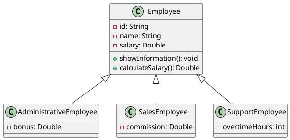

## Caso: sistema de empleados

Una empresa tiene diferentes tipo de empleados:
- Empleados administrativos
- Empleados de ventas
- Empleados de soporte

Todos los empleados tienen:
- Código
- Nombre
- Sueldo

Además, cada tipo de empleado tiene características específicas.

